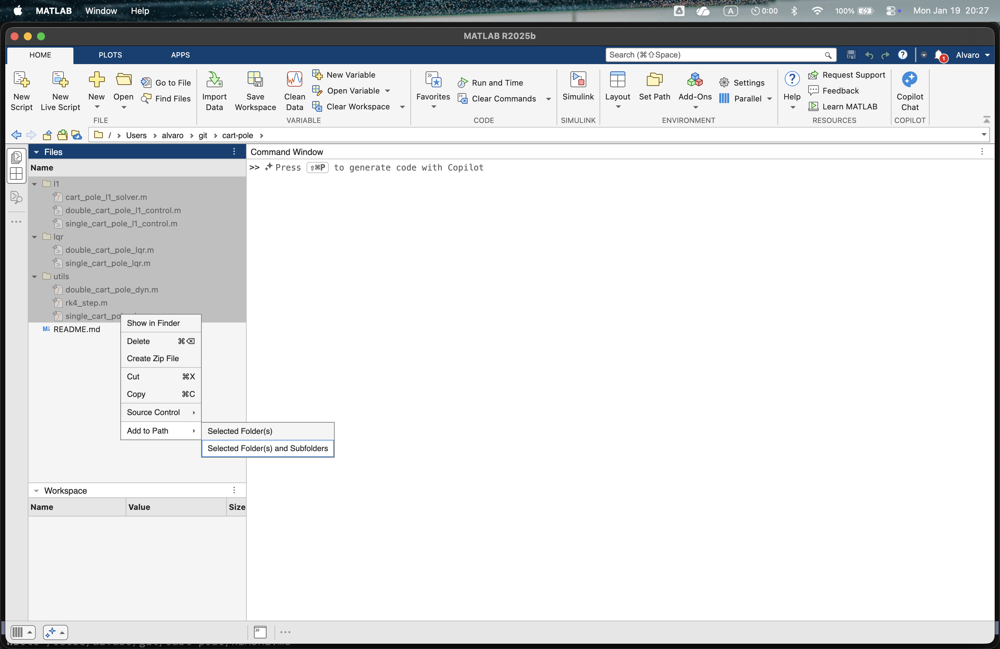

# Cart-pole

In this repository, you can find nonlinear dynamics of the single and double inverted pendulum on a cart.

## Controllers

- LQR Controllers
- L1 Adaptive Controllers

## Usage

1. In the root of the repository, in MATLAB, add all three folders to the PATH.

2. Then just run any LQR or L1 simulation script (e.g. `l1/double_cart_pole_l1_control.m`).

## License

[MIT](LICENSE)
